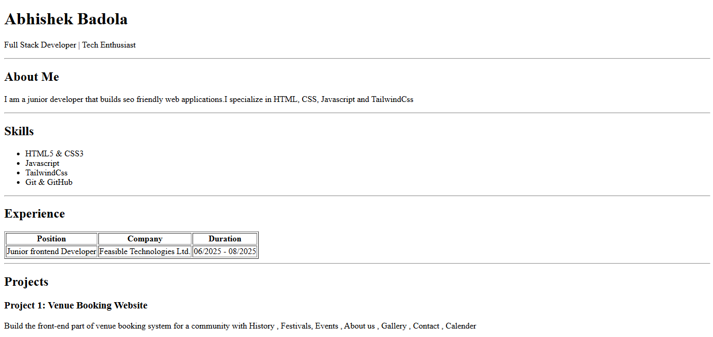
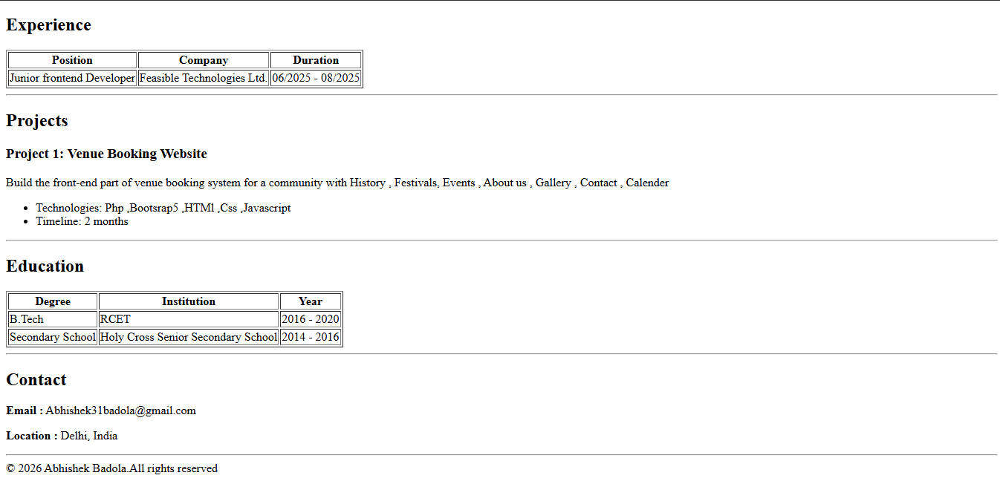

# HTML Resume 

Resume created with HTMl only

## 🚀 Live Demo

[view the site live here] (https://abhisheklp99.github.io/Web_Dev_Cohort-2026-HTML_Resume/)

## 🏗 Section Created

* **Name section**

* **About**

* **Skills list**

* **Experience table**

* **Projects**

* **Education table**

* **Contact details**

* **Footer**

## 🎨 Design System

This Project used HTML only and its basic introduction to creating a resume without css  and learning about basic Html tags

## 📸 Preview

